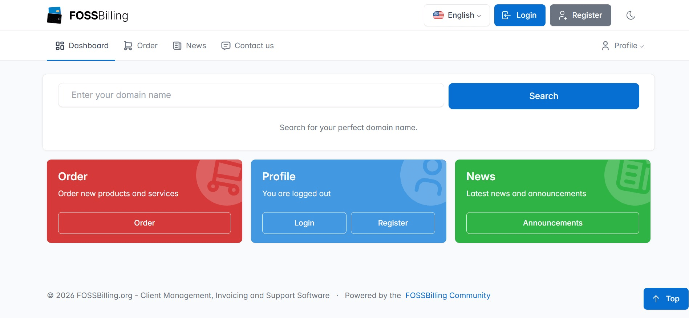

# Tide Theme for FOSSBilling

## Overview

Tide is a client area theme for FOSSBilling. It's designed to enhance your user interface with a clean, modern aesthetic. This guide provides steps on how to install, upgrade, secure, and customize the Tide theme.

## Installation

Follow these steps to install the Tide theme:

1. Clone this repository or download the latest version.
2. Extract the files and move the `tide` directory into the `FOSSBilling directory/themes`.
3. Change the directory owner to the user your web server runs under. For example: `chown -Rf www-data:www-data tide/`.
4. Set permissions to `750` using chmod: `chmod -Rf 750 tide/`.
5. Navigate to `Settings -> Themes` in the FOSSBilling admin panel and select `tide` as the default theme.

## Upgrade (for v1.0.x only)

To upgrade to a newer version of the Tide theme, perform the following:

1. Clone this repository or download the latest version.
2. Backup your `FOSSBilling directory/themes/tide/config/settings_data.json` and any custom assets located at `FOSSBilling directory/themes/tide/assets`. Pay close attention if you have customized the CSS file at `FOSSBilling directory/themes/tide/assets/css/custom.css`.
3. Extract the latest version and move the `tide` directory into `FOSSBilling directory/themes`, overwriting all files.
4. Restore your `settings_data.json` and any custom assets from the backup.
5. Change the directory owner to the web server user. For example: `chown -Rf www-data:www-data tide/`.
6. Set permissions to `750` using chmod: `chmod -Rf 750 tide/`.

## Security Measures for Prior Installations (Before 0.9.5)

For versions of Tide installed prior to 0.9.5, implement these security measures:

1. Change the directory owner to the web server user. For example: `chown -Rf www-data:www-data tide/`.
2. Set permissions to `750` using chmod: `chmod -Rf 750 tide/`.

## Theme Customization

Tide now allows you to replace default colours with custom ones, enabling you to align the theme with your branding. To make these changes, edit the `FOSSBilling directory/themes/tide/assets/css/custom.css` file as per the comments provided within it.

## Support

Your feedback and inquiries are invaluable to Namingo's evolutionary journey. If you need support, have questions, or want to contribute your thoughts:

- **Email**: Feel free to reach out directly at [help@namingo.org](mailto:help@namingo.org).

- **Discord**: Or chat with us on our [Discord](https://discord.gg/97R9VCrWgc) channel.
  
- **GitHub Issues**: For bug reports or feature requests, please use the [Issues](https://github.com/getpinga/tide/issues) section of our GitHub repository.

We appreciate your involvement and patience as Namingo continues to grow and adapt.

## Support This Project

If you find Tide useful, consider donating:

- [Donate via Stripe](https://donate.stripe.com/7sI2aI4jV3Offn28ww)
- BTC: `bc1q9jhxjlnzv0x4wzxfp8xzc6w289ewggtds54uqa`
- ETH: `0x330c1b148368EE4B8756B176f1766d52132f0Ea8`

## Licensing

Tide is licensed under the Apache License, Version 2.0 starting from version 1.1.

Versions 1.0 and earlier are licensed under the MIT License.

This project includes and builds upon code from Huraga, the default template of the FOSSBilling platform.