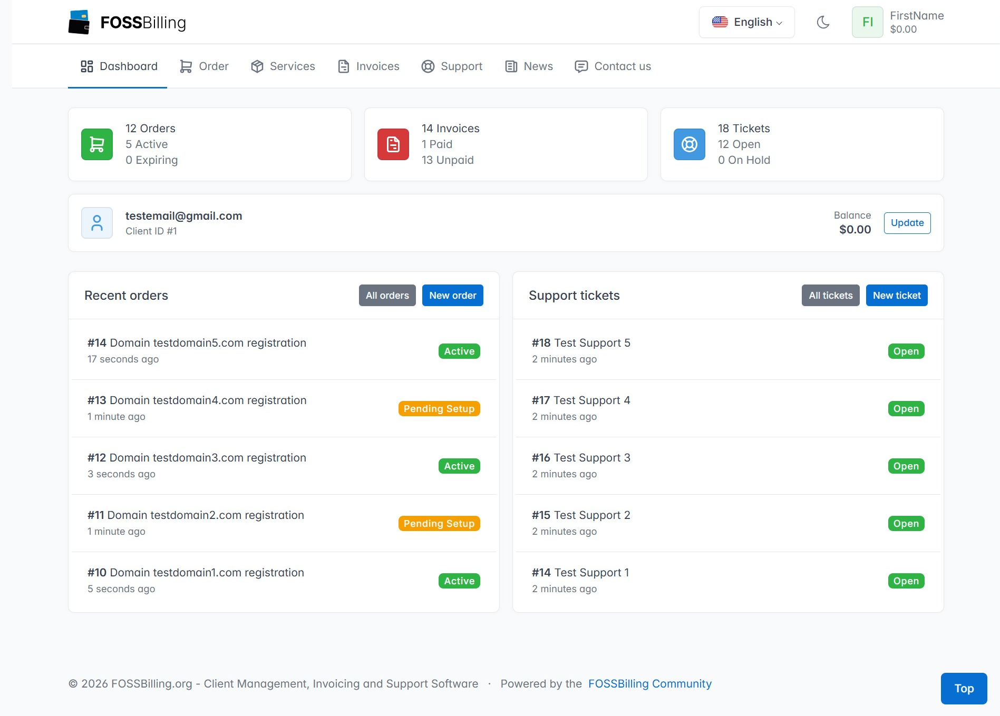

# Tide Theme for FOSSBilling

[](https://github.com/vshymanskyy/StandWithUkraine/blob/main/docs/README.md)

[](https://github.com/vshymanskyy/StandWithUkraine/blob/main/docs/README.md)

## Overview

Tide is a client area theme for FOSSBilling. It's designed to enhance your user interface with a clean, modern aesthetic. This guide provides steps on how to install, upgrade, secure, and customize the Tide theme.




## Installation

Follow these steps to install the Tide theme:

1. Download or clone this repository.

   - If you downloaded a ZIP file, extract it first.
   - If you cloned the repository, locate the main project folder.
  
2. Inside the downloaded/cloned files, you will find a directory containing the theme files
   (for example: `tide-main`, `tide-v1.1.0`, or similar).

3. Rename this directory to `tide`.

4. Move the renamed `tide` directory into your FOSSBilling themes folder: `FOSSBilling directory/themes`.

5. Change the directory owner to the user your web server runs under. For example: `chown -Rf www-data:www-data tide/`.

6. Set permissions to `750` using chmod: `chmod -Rf 750 tide/`.

7. Navigate to `Settings -> Themes` in the FOSSBilling admin panel and select `tide` as the default theme.

## Upgrade

To upgrade to a newer version of the Tide theme, perform the following:

1. Download or clone this repository.

   - If you downloaded a ZIP file, extract it first.
   - If you cloned the repository, locate the main project folder.
  
2. Inside the downloaded/cloned files, you will find a directory containing the theme files
   (for example: `tide-main`, `tide-v1.1.0`, or similar).

3. Rename this directory to `tide`.

4. Backup your `FOSSBilling directory/themes/tide/config/settings_data.json` and any custom assets located at `FOSSBilling directory/themes/tide/assets/custom` and `FOSSBilling directory/themes/tide/html/custom`.

5. Move the renamed `tide` directory into your FOSSBilling themes folder: `FOSSBilling directory/themes`, overwriting all files.

6. Restore your `settings_data.json` and any custom assets from the backup.

7. Change the directory owner to the web server user. For example: `chown -Rf www-data:www-data tide/`. Set permissions to `750` using chmod: `chmod -Rf 750 tide/`.

### Upgrade from v1.1.3

If you customized your CSS in v1.1.3 or earlier, move `FOSSBilling directory/themes/tide/assets/css/extra.css` to `FOSSBilling directory/themes/tide/assets/custom/extra.css` before upgrading and follow Section 2 of the Theme Customization section below.

### Security Measures for Prior Installations (Before 0.9.5)

For versions of Tide installed prior to 0.9.5, implement these security measures:

1. Change the directory owner to the web server user. For example: `chown -Rf www-data:www-data tide/`.
2. Set permissions to `750` using chmod: `chmod -Rf 750 tide/`.

## Theme Customization

Tide is designed to be safely customizable without modifying core template files.  
To prevent your changes from being overwritten during updates, use the supported customization methods below.

### 1. Dashboard Layout

Tide provides optional hook points that allow you to extend specific dashboard areas without editing core files.

To use them, create the following files inside `FOSSBilling directory/themes/tide/html/custom/`:

`dashboard.top.twig` – customizes the top area of the dashboard  
`dashboard.widgets.twig` – customizes the widgets section  
`dashboard.bottom.twig` – customizes the bottom area of the dashboard  

Each file corresponds to its respective dashboard area.  
It is safe if one or more of these files are missing — Tide will continue to function normally.

For consistent layout and spacing, follow the default Tide dashboard structure:

- For `dashboard.top.twig` and `dashboard.bottom.twig`, wrap your content inside a Bootstrap `row row-cards` container and place elements inside `card` components.
- For `dashboard.widgets.twig`, use a standard `row`, as it is already rendered within the dashboard widgets grid context.

This ensures visual consistency with the default Tide dashboard styling.

### 2. Theme Colours

Tide allows you to replace the default colours with custom ones, so you can align the theme with your branding.

1. Create the following file to load your custom CSS automatically:

`FOSSBilling directory/themes/tide/html/custom/head.extra.twig`

Paste this content inside:

```twig
<link href="{{ 'custom/extra.css' | asset_url }}" rel="stylesheet"/>
```

2. Create `FOSSBilling directory/themes/tide/assets/custom/extra.css` and place your custom CSS overrides inside it, following the example below.

```css
.bg-primary {
     background-color: #your-color !important;
}
.text-primary {
     color: #your-color !important;
}
.btn-primary {
     background-color: #your-color !important;
     border-color: #your-color !important;
}
.btn-primary:hover {
     background-color: #your-hover-color !important;
     border-color: #your-hover-color !important;
}
.btn-primary:focus {
     background-color: #your-focus-color !important;
     border-color: #your-focus-color !important;
     box-shadow: 0 0 0 0.2rem rgba(#your-color, 0.5) !important;
}
.btn-primary:active {
     background-color: #your-active-color !important;
     border-color: #your-active-color !important;
}
.btn-primary:disabled {
     background-color: #your-disabled-color !important;
     border-color: #your-disabled-color !important;
}
```

Because this file is placed under `assets/custom/`, it is not part of the standard Tide files and will not be rewritten during a normal update.

Backups are still encouraged as a best practice. However, you should not need to restore this file after upgrading unless your update process deletes the entire theme folder.

## Support

Your feedback and inquiries are invaluable to Namingo's evolutionary journey. If you need support, have questions, or want to contribute your thoughts:

- **Email**: Feel free to reach out directly at [help@namingo.org](mailto:help@namingo.org).

- **Discord**: Or chat with us on our [Discord](https://discord.gg/97R9VCrWgc) channel.
  
- **GitHub Issues**: For bug reports or feature requests, please use the [Issues](https://github.com/getpinga/tide/issues) section of our GitHub repository.

We appreciate your involvement and patience as Namingo continues to grow and adapt.

## Support This Project

If you find Tide useful, consider donating:

- [Donate via Stripe](https://donate.stripe.com/7sI2aI4jV3Offn28ww)
- BTC: `bc1q9jhxjlnzv0x4wzxfp8xzc6w289ewggtds54uqa`
- ETH: `0x330c1b148368EE4B8756B176f1766d52132f0Ea8`

## Licensing

Tide is licensed under the Apache License, Version 2.0 starting from version 1.1.

Versions 1.0 and earlier are licensed under the MIT License.

This project includes and builds upon code from Huraga, the default template of the FOSSBilling platform.